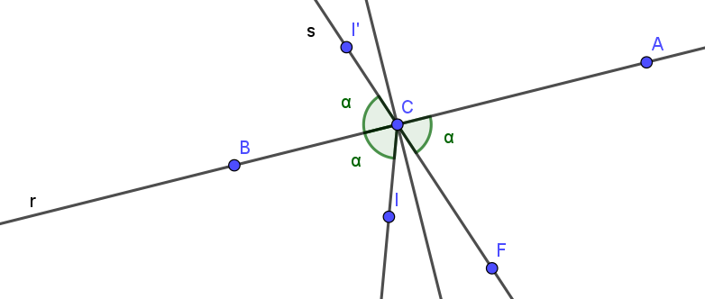

# Introducción a la solución

Para cada lado del polígono convexo que forma la mesa de billar hay como mucho una trayectoria entre la posición inicial, $I$ y la posicion final, $F$. Para saber si existe o no es necesario fijar un punto $C$ en la recta del segmento $AB$ (que llamaremos a partir de ahora $r$) que representa el punto de colisión con el lado.

Gracias a que los ángulos de incidencia son iguales, el punto $I'$ que es simétrico a $I$ respecto de $r$ pertenece a la recta que forma $F$ y $C$ (a partir de ahora $r$). Por tanto podemos decir que:
$$C = A + \lambda \overrightarrow{AB}$$
$$C = F + \mu \overrightarrow{FI'}$$

Por igualación:

$$A + \lambda \overrightarrow{AB} = F + \mu \overrightarrow{FI'}$$

$$A-F = \mu \overrightarrow{FI'} - \lambda \overrightarrow{AB}$$

$$\overrightarrow{FA} = \mu \overrightarrow{FI'} - \lambda \overrightarrow{AB}$$

$$
\begin{pmatrix}
\overrightarrow{FA}_x \\
\overrightarrow{FA}_y \\
\end{pmatrix} = 
\begin{pmatrix}
\overrightarrow{FI'}_x & -\overrightarrow{AB}_x \\
\overrightarrow{FI'}_y & 
-\overrightarrow{AB}_y\\
\end{pmatrix}
\begin{pmatrix}
\lambda \\
\mu\\
\end{pmatrix}
$$

Si resolvemos el sistema usando la regla de Cramer:

$$
\lambda = \frac{
\begin{vmatrix}
\overrightarrow{FI'}_x & 
\overrightarrow{FA}_x \\
\overrightarrow{FI'}_y & 
\overrightarrow{FA}_y\\
\end{vmatrix}
}{
\begin{vmatrix}
\overrightarrow{FI'}_x & 
-\overrightarrow{AB}_x \\
\overrightarrow{FI'}_y & 
-\overrightarrow{AB}_y\\
\end{vmatrix}
} = \frac{
    \overrightarrow{FI'} \times
    \overrightarrow{FA}
}
{
    \overrightarrow{FI'} \times
    -\overrightarrow{AB}
}
$$

De esta forma podemos calcular $C$. Solo nos queda comprobar que $C$ está entre $A$ y $B$ (ya sabemos que pertenece a $r$).

Por cada lado en el que el punto de colisión $C$ pertenece al segmento es una trayectoria más.

# Soluciones

| Solución | Verificado con el juez |
| :------: | :--------------------: |
| [I.cpp](src/B.cpp) | :white_check_mark: |

